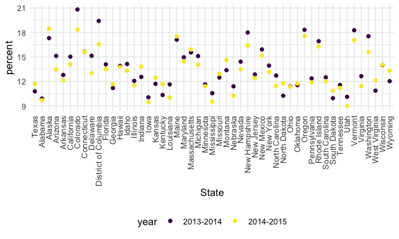

Strings and Factors
================

## Strings and regex

``` r
string_vec = c("my", "name", "is", "jingyi")

str_detect(string_vec, "jingyi")  #or a single letter will detect anything contains that particular letter, case sensitive
```

    ## [1] FALSE FALSE FALSE  TRUE

``` r
str_replace(string_vec, "jingyi", "Jingyi") #replace some things
```

    ## [1] "my"     "name"   "is"     "Jingyi"

``` r
string_vec = c(
  "i think we all rule for participating",
  "i think i have been caught",
  "i think this will be quite fun",
  "it will be fun, i think"
)

str_detect(string_vec, "^i think") #detect sth begins with...
```

    ## [1]  TRUE  TRUE  TRUE FALSE

``` r
str_detect(string_vec, "i think$") #detect sth ends with...
```

    ## [1] FALSE FALSE FALSE  TRUE

``` r
string_vec = c(
  "Y' all remember Pres. HW Bush?",
  "I saw a green bush",
  "BBQ and Bushwalking at Molonglo Gorge",
  "BUSH -- LIVE IN CONCERT!!"
)

str_detect(string_vec, "[Bb]ush") #capital or lower case "b"
```

    ## [1]  TRUE  TRUE  TRUE FALSE

``` r
string_vec = c(
  '7th inning stretch',
  '1st half soon to begin. Texas won the toss.',
  'she is 5 feet 4 inches tall',
  '3AM - cant sleep :('
)

#number first followed immediately by a letter
str_detect(string_vec, "[0-9][a-zA-Z]")
```

    ## [1]  TRUE  TRUE FALSE  TRUE

``` r
string_vec = c(
  'Its 7:11 in the evening',
  'want to go to 7-11?',
  'my flight is AA711',
  'NetBios: scanning ip 203.167.114.66'
)

str_detect(string_vec, "7.11") # . will match anything
```

    ## [1]  TRUE  TRUE FALSE  TRUE

``` r
str_detect(string_vec, "7\\.11") # an actual . between two numbers
```

    ## [1] FALSE FALSE FALSE  TRUE

``` r
string_vec = c(
  'The CI is [2, 5]',
  ':-]',
  ':-[',
  'I found the answer on pages [6-7]'
)

str_detect(string_vec, "\\[") # anything has "["
```

    ## [1]  TRUE FALSE  TRUE  TRUE

## Factors

``` r
factor_vec = factor(c("male", "male", "female", "female"))

factor_vec
```

    ## [1] male   male   female female
    ## Levels: female male

``` r
as.numeric(factor_vec) # female = 1, male = 2
```

    ## [1] 2 2 1 1

what happens if i relevel

``` r
factor_vec = fct_relevel(factor_vec, "male") #  you can move factors by hand

factor_vec
```

    ## [1] male   male   female female
    ## Levels: male female

``` r
as.numeric(factor_vec) # male = 1, female = 2
```

    ## [1] 1 1 2 2

fct\_reorder

str\_count str\_locate str\_extract

## NSDUH – strings

``` r
url = "http://samhda.s3-us-gov-west-1.amazonaws.com/s3fs-public/field-uploads/2k15StateFiles/NSDUHsaeShortTermCHG2015.htm"

drug_use_html = read_html(url)

table_marj =
  drug_use_html %>% 
  html_nodes(css = "table") %>% 
  first() %>% 
  html_table() %>%
  slice(-1) %>% 
  as_tibble()
```

``` r
data_marj = 
  table_marj %>%
  select(-contains("P Value")) %>% # very similar to str_detect
  pivot_longer(
    -State,
    names_to = "age_year",
    values_to = "percent"
  ) %>%
  separate(age_year, into = c("age", "year"), sep = "\\(") %>%
  mutate(
    year = str_replace(year, "\\)", ""),
    percent = str_replace(percent, "[a-c]$", ""),
    percent = as.numeric(percent)
  ) %>%
  filter(!(State %in% c("Total U.S.", "Northeast", "Midwest", "South", "West")))
```

## NSDUH – factors

fct\_relevel

``` r
data_marj %>%
  filter(age == "12-17") %>%
  mutate(State = fct_relevel(State, "Texas")) %>%  # move texas to the very first of the list
  ggplot(aes(State, y = percent, color = year)) +
  geom_point() +
  theme(axis.text.x = element_text(angle = 90, vjust = 0.5, hjust = 1))
```



fct\_reorder

``` r
data_marj %>%
  filter(age == "12-17") %>%
  mutate(State = fct_reorder(State, percent)) %>%
  ggplot(aes(State, y = percent, color = year)) +
  geom_point() +
  theme(axis.text.x = element_text(angle = 90, vjust = 0.5, hjust = 1))
```


